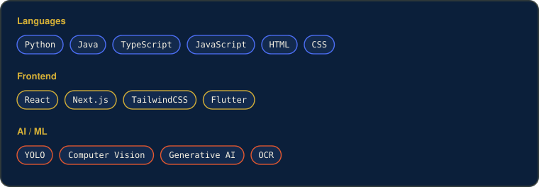
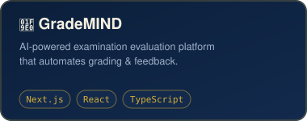
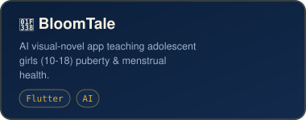
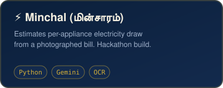
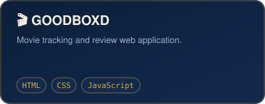
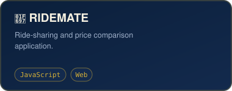
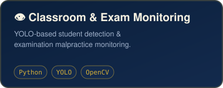

<p align="center">
  
</p>
About Me
```js
const meenakshi = {
  role: "Computer Science Engineering student",
  university: "Sri Shakthi Institute of Engineering and Technology, Coimbatore",
  graduating: 2028,
  focus: ["AI/ML", "full-stack web", "computer vision", "generative AI"],
  currentlyBuilding: "AI-powered apps across ed-tech, hackathons, and web",
  mindset: "Turn ideas into working products, one project at a time"
};
```
🤖 Building practical AI-powered applications across ed-tech, health, and utilities
🌐 Exploring full-stack web development with React, Next.js, and Tailwind
👁️ Interested in Computer Vision & Generative AI
🧩 Currently strengthening Data Structures & Algorithms
🚀 Love turning ideas into working products and hackathon projects
🎯 Goal: build useful products, contribute to open source, keep improving
Tech Arsenal
<p align="center">
  
</p>

AI Stack
Claude · ChatGPT · Gemini
<p align="center">
  
  
  
</p>
Featured Work
 
 
 
> 📌 Swap the `href` targets above for your real repo URLs once each project is pushed.
GitHub Dashboard
<p align="center">
  
  
</p>
<p align="center">
  
</p>
<p align="center">
  
</p>
Contribution Snake

> ⚙️ This needs `.github/workflows/snake.yml` (included) committed to your repo. GitHub Actions will generate the snake automatically on a daily schedule — see setup notes below.
More About The Build
What I like building
Practical, working products at the intersection of AI and the web — education tools, computer vision systems, hackathon utilities, and full-stack apps that solve a real problem immediately.
Current focus
Strengthening Data Structures & Algorithms fundamentals
Going deeper on applied GenAI and computer vision
Shipping more full-stack projects end-to-end
Exploring backend development alongside AI/ML
Current repositories on my map
GradeMIND — AI-powered examination evaluation platform (Next.js, React, TypeScript)
BloomTale — AI visual-novel app teaching adolescent health topics (Flutter)
Minchal (மின்சாரம்) — Electricity consumption estimator from a photographed bill (Python, Gemini, OCR)
GOODBOXD — Movie tracking and review application (HTML, CSS, JavaScript)
RIDEMATE — Ride-sharing and price comparison app (JavaScript)
Classroom & Exam Monitoring — YOLO-based detection system (Python, YOLO, OpenCV)
Pathfinder — AI-powered career guidance platform
Connect
  
