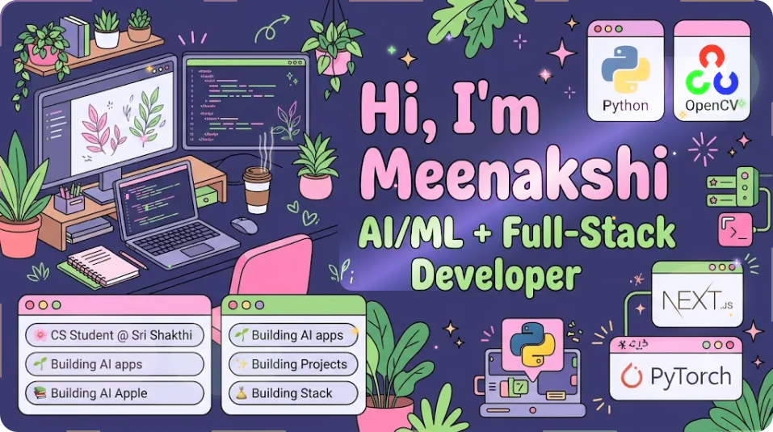

  

  

  
  
  
  

  

  

## 🌸 About Me

  

<table>
<tr>
<td width="50%" valign="top">

### 🌱 What I Do & Build
- 🤖 **AI & Intelligent Systems**: Developing practical applications for ed-tech, healthcare, and everyday utilities
- 🌐 **Modern Full-Stack**: Crafting responsive, aesthetic web applications with **React**, **Next.js**, and **TailwindCSS**
- 👁️ **Computer Vision & GenAI**: Building pipelines with **OpenCV**, **YOLO**, and modern LLM APIs
- 📱 **Cross-Platform**: Building interactive cross-platform solutions with **Flutter** & **Python**

</td>
<td width="50%" valign="top">

### ✨ Current Journey & Goals
- 📚 **DSA Fundamentals**: Actively sharpening algorithmic problem solving in Python & Java
- 🧠 **Deep Learning**: Advancing deep learning architectures & model training with **PyTorch**
- 🛠️ **Production Backends**: Designing resilient REST APIs and database schemas
- 🤝 **Open Collaboration**: Excited to contribute to open-source and high-impact developer tools

</td>
</tr>
</table>

  

## 🛠️ Tech Arsenal

  

  

<table>
<tr>
<td width="50%" valign="top">

#### 🤖 AI & Machine Learning

  
  
  
  
  
  

Computer Vision · Object Detection · Generative AI · Deep Learning

</td>
<td width="50%" valign="top">

#### 🌐 Frontend & Mobile

  
  
  
  
  
  

Responsive Web Apps · Cross-Platform Mobile · Design Systems

</td>
</tr>
<tr>
<td width="50%" valign="top">

#### 💾 Backend & Databases

  
  
  
  
  
  
  
  

RESTful APIs · ORMs · Relational & NoSQL Datastores · Caching

</td>
<td width="50%" valign="top">

#### 🛠️ DevOps, Cloud & Tooling

  
  
  
  
  
  
  

Containerization · CI/CD · API Testing · Cloud Deployments

</td>
</tr>
</table>

  

## 🚀 Featured Work

<table>
<tr>
<td align="center" width="50%"></td>
<td align="center" width="50%"></td>
</tr>
<tr>
<td align="center"></td>
<td align="center"></td>
</tr>
<tr>
<td align="center"></td>
<td align="center"></td>
</tr>
</table>

  🧭 <i>Also exploring:</i> <b>Pathfinder</b> — <i>AI-powered personalized career guidance & roadmaps</i> 🌸

  

## 📊 GitHub Analytics

  
  

  

  

  

## 🐍 Contribution Journey

  

  

## 💌 Let's Connect

  
  
  

  

  

